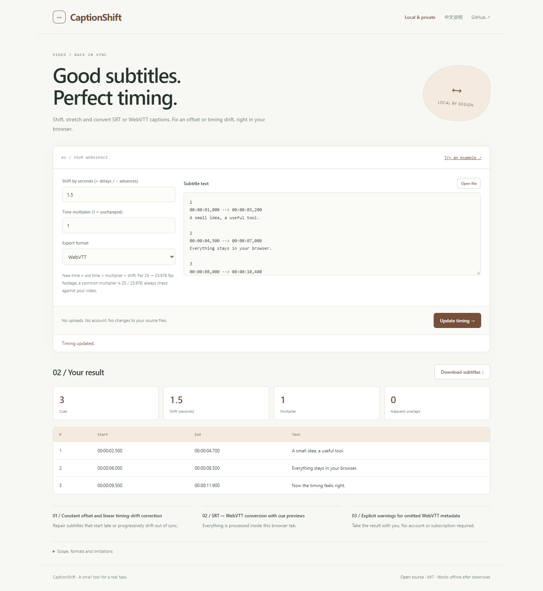

# CaptionShift

**Good subtitles. Perfect timing.**

Shift, stretch and convert SRT or WebVTT captions. Fix an offset or timing drift, right in your browser.

[Open the app](https://sq2100.com/captionshift/) · [Download offline HTML](https://github.com/sq2100/captionshift/releases/latest) · [简体中文](README.zh-CN.md)



## Why use it?

Repair subtitles that start late or progressively drift out of sync.

- Constant offset and linear timing-drift correction
- SRT ↔ WebVTT conversion with cue previews
- Explicit warnings for omitted WebVTT metadata

No uploads, account, API key, tracking scripts, or runtime CDN dependencies. The built app is a single HTML file. Source files are never modified.

## Quick start

Open the [hosted app](https://sq2100.com/captionshift/) and click **Try an example**. Or download the HTML from [Releases](https://github.com/sq2100/captionshift/releases/latest), then open it in a modern desktop browser.

To build from source (Node.js 20.19+):

```sh
npm ci
npm test
npm run build
```

Open `dist/index.html`, or run `npm start` for a local preview at http://127.0.0.1:4178. Set the `PORT` environment variable to run multiple projects simultaneously.

## Scope and limitations

Supports text cues in SRT and WebVTT. This is not audio alignment or transcription. WebVTT NOTE, STYLE, REGION blocks and header metadata are omitted with warnings. Cue settings are retained for VTT and omitted for SRT; text markup is kept as written. Cues starting before zero, reversed intervals or outputs ≥100 hours are rejected. Overlaps are counted between adjacent cues, not automatically fixed. UTF-8 file imports up to 5 MiB.

The initial version targets modern desktop browsers. Chromium is used for local smoke checks. Browser differences and real-world data may reveal additional edge cases; please report reproducible problems with synthetic examples. No guarantee of suitability for every input is made.

## Privacy

The app processes data in memory and has no application server, analytics, cookies, local storage or external runtime resources. A Content Security Policy blocks network connections and external scripts. User data is rendered as text, except for the intentionally previewed local images and validated colors.

The hosting provider receives normal page-request metadata (such as IP addresses). Download the HTML and open it offline for disconnected work. Exported files may contain your data. Browser extensions, the operating system and a modified hosted copy are outside this app's control.

## Development

Plain JavaScript, browser APIs, Node’s built-in test runner, and esbuild. Core logic lives in `src/core.js`; UI behavior is in `src/app.js`. Run `npm run format` before sending changes. GitHub Actions tests and builds each push; the separate Pages workflow publishes the demo when run manually.

[Contributing](CONTRIBUTING.md) · [Security](SECURITY.md) · [MIT license](LICENSE)
